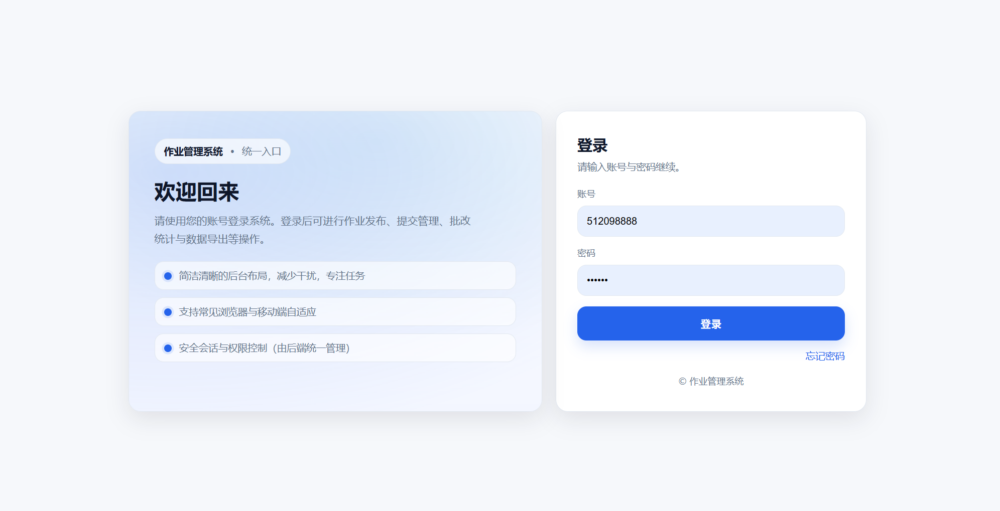
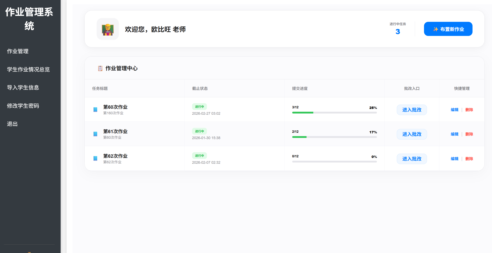
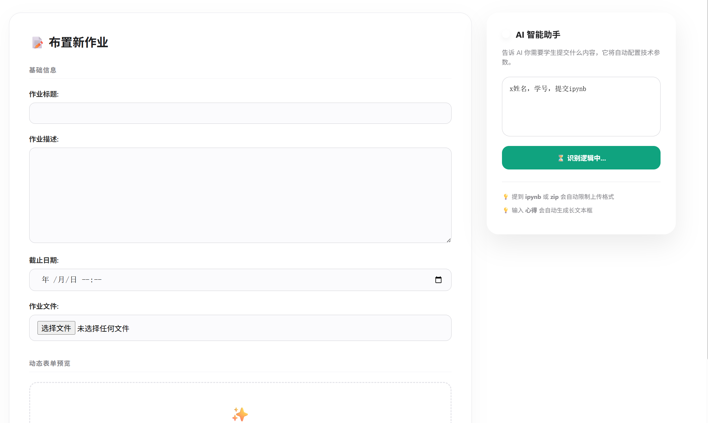
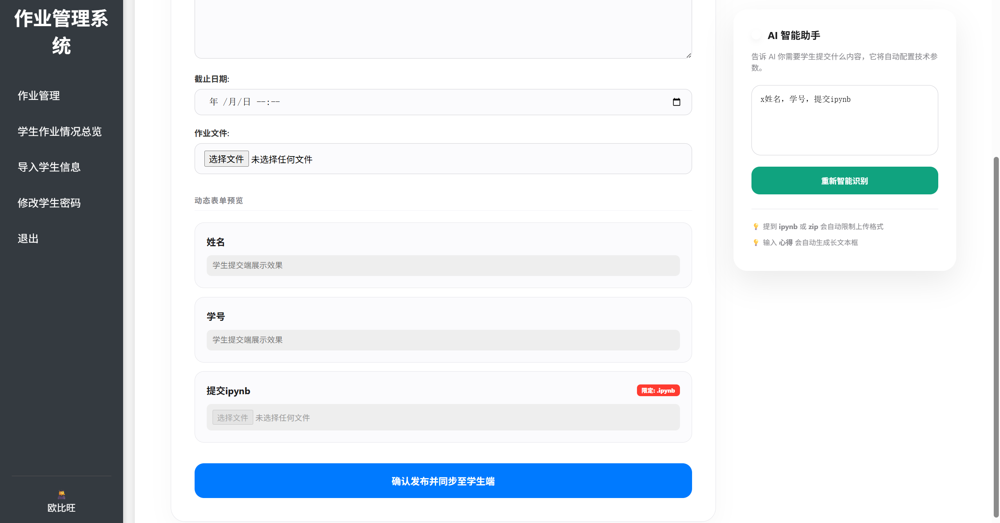
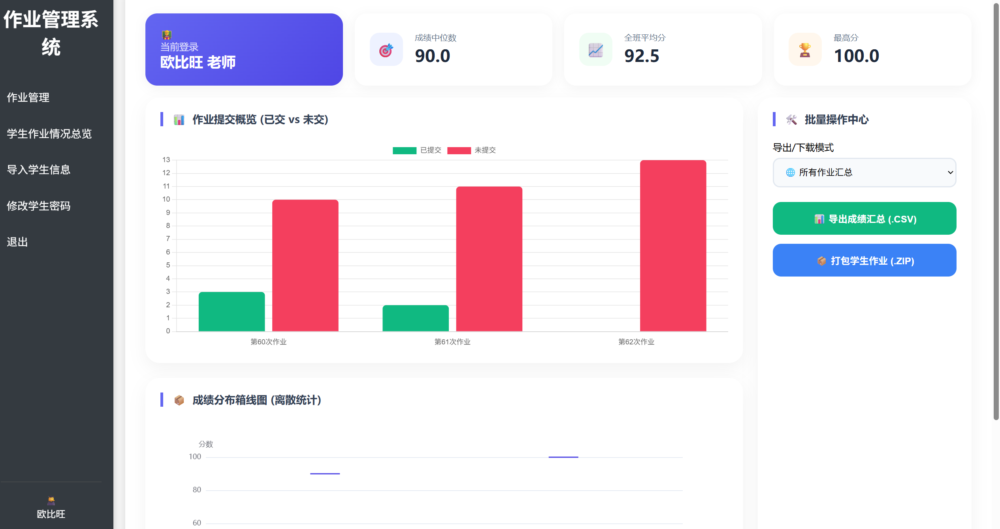
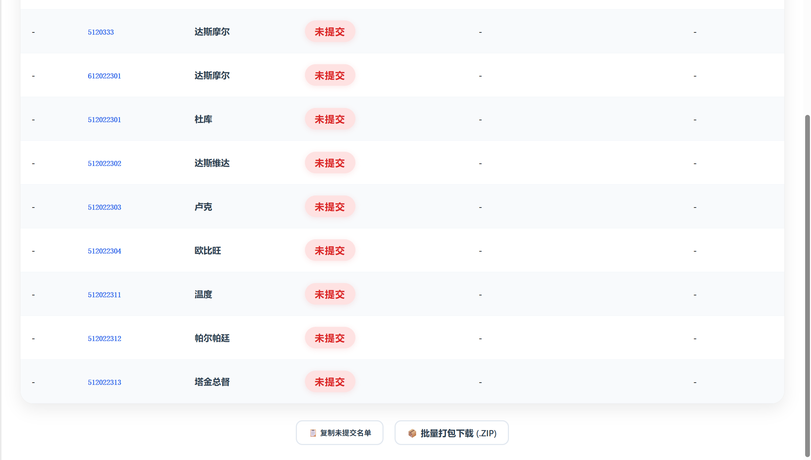
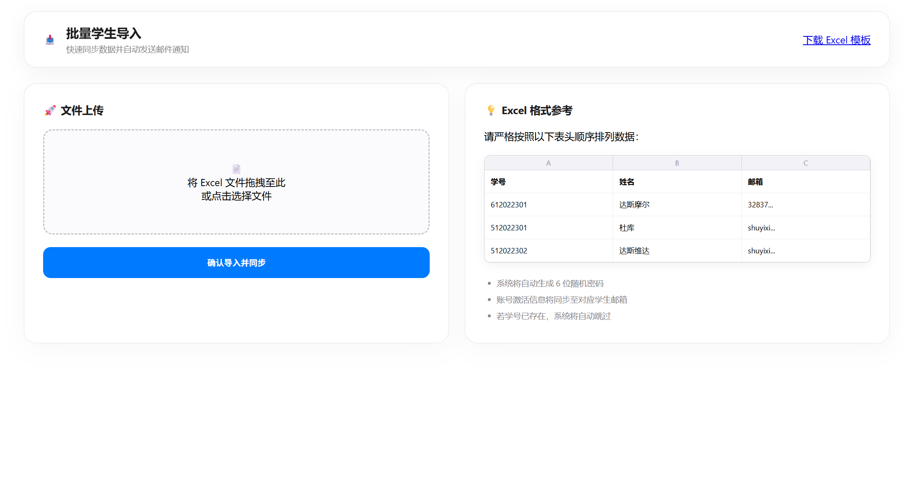
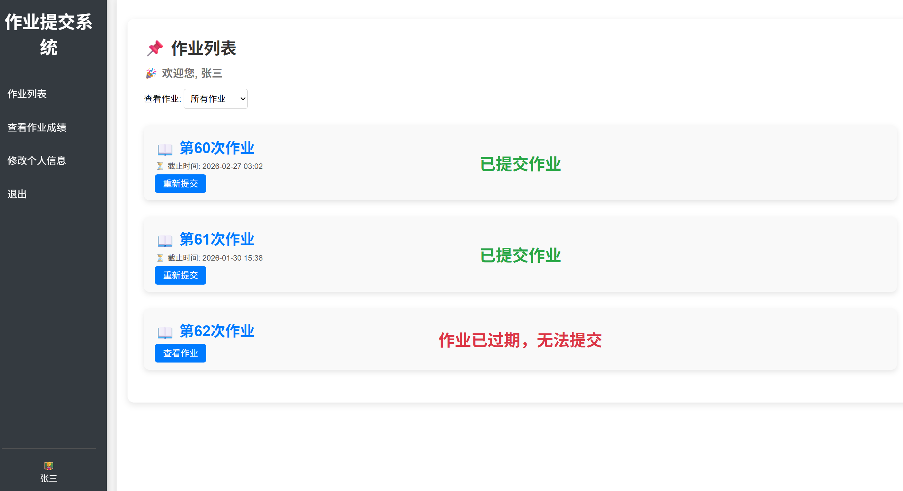
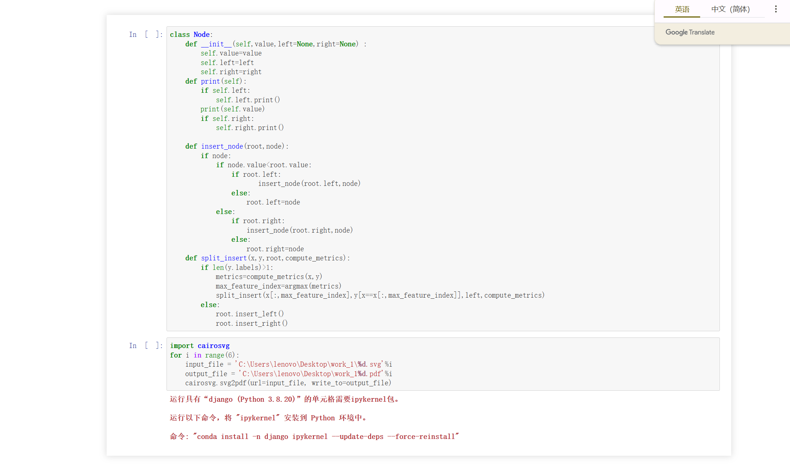

由于你的项目已经从简单的 Django 管理系统升级为集成了 **Celery + Redis** 异步队列和 **Docker** 容器化的工业级架构，这份 README 将重点突出这些技术亮点。

你可以根据以下模板进行填充，图片部分我已为你留出占位符。

---

# 🎓 智能教务资源自动化采集与数据分析系统

本系统是一套基于 **Django** 框架开发的教务管理平台，集成了 **Ollama (Qwen2-7B)** 大模型实现智能表单生成，并利用 **Celery + Redis** 异步架构处理高并发数据采集与邮件分发。

## 🌟 核心功能

* **智能数据采集 (Web Scraping)**：支持多源教育平台作业与附件的自动化抓取，具备动态 UA 切换与代理对抗能力。
* **AI 驱动的表单生成**：集成 Ollama (Qwen2-7B)，通过自然语言需求自动生成结构化 JSON 动态表单。
* **异步任务队列**：基于 Celery 实现邮件批量分发与长耗时 AI 推理，确保 Web 响应无阻塞。
* **自动化文件理算**：独立自研路径重映射算法，将散乱附件按“作业名_姓名_学号”自动重组归档。
* **多维学情看板**：利用 ECharts 动态展示成绩分布（箱线图）与提交率统计。

---

## 📸 界面展示

### 1. 登录与注册界面

> 支持教师与学生双角色登录，具备验证码找回密码功能。

****

### 2. 老师端：作业与资源管理

> 涵盖作业布置、AI 智能表单配置及学生提交进度实时监控。

****

### 3. AI 智能识别配置

> 通过对话框输入需求，AI 自动生成对应的表单字段结构。

****
****

### 4. 数据分析可视化看板

> 展示学生成绩的离散度分析、平均分及提交率正态分布。

****
> 可导出学生成绩，并且复制未提交学生名字姓名。

****

### 5. 批量导入学生信息
> 支持多种上传excel导入学生信息的功能，有提供模板。
****


### 6. 学生端：作业提交与反馈

> 支持多种附件上传，并提供在线预览 Jupyter Notebook (.ipynb) 的功能。

****
****

---

## 🛠 技术栈

* **后端**: Python 3.10, Django 4.2
* **任务编排**: Celery 5.x, Redis 7.0
* **智能引擎**: Ollama (Qwen2-7B)
* **数据处理**: Pandas, NumPy, SymPy
* **可视化**: ECharts, Matplotlib, Seaborn
* **容器化**: Docker, Docker-Compose

---

## 🚀 快速启动 (Docker 部署)

1. **环境准备**：确保宿主机已安装 Docker 和 Docker Desktop。
2. **构建镜像**：
```bash
docker-compose up --build

```


3. **数据库初始化**：
```bash
docker-compose exec web python manage.py migrate

```


---


